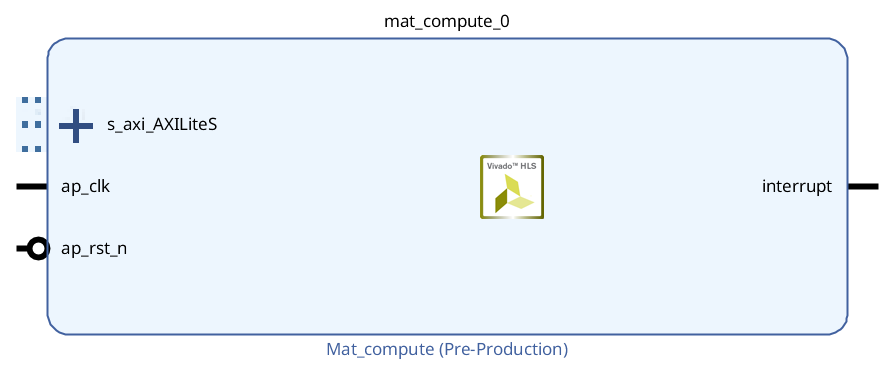
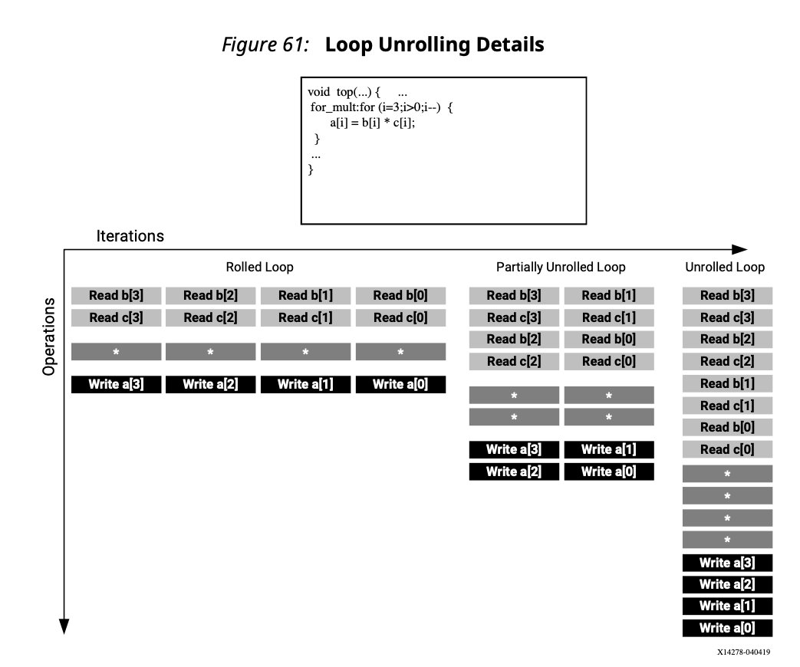
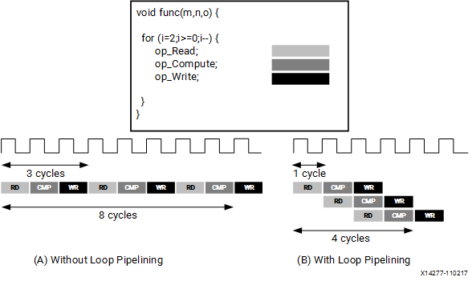
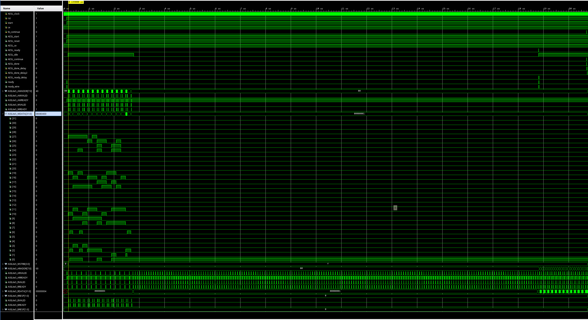
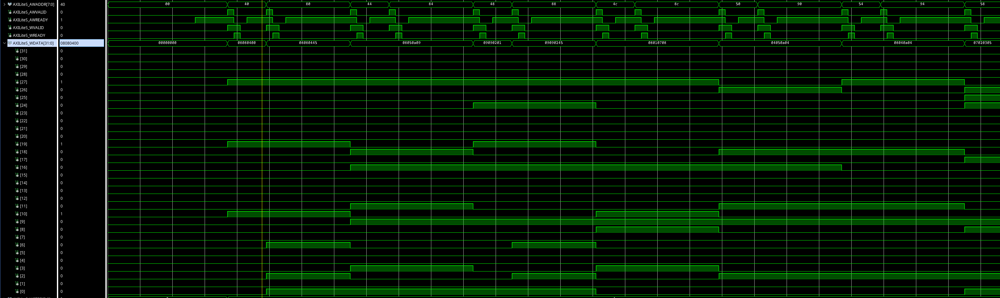

<div align="center">


<h3 style="margin-top: 50px;">Федеральное государственное автономное образовательное учреждение высшего образования</h3>

<h3 style="margin-top: 50px;">Университет ИТМО</h3>

<h3 style="margin-top: 50px;">Системы на кристалле</h3>
<h3>Лабораторная работа №3</h3>
<h3>"Высокоуровневый синтез функциональных блоков СнК"</h3>

<h3 style="margin-top: 50px;">Вариант 1</h3>

<div style="margin-left: 500px; margin-top: 100px; text-align: right">
<h3>Выполнили:</h3>
<h4>Бутвин Михаил Павлович, Группа P3430</h4>
<h4>Николаев Павел Дмитриевич, Группа P3430</h4>
<h4>Хабнер Георгий Евгеньевич, Группа P3431</h4>
</div>

<h3 style="margin-top: 50px;">СПб – 2025</h3>
</div>
<div style="page-break-after: always;"></div>

## Вариант

**Вариант 1**: Разработать аппаратный ускоритель для вычисления `C = A + B*B` для матриц 7x7 (uint8_t)

## Изображение аппаратного ускорителя с интерфейсом

<div align="center">

<p><i>Рис. 1. Структура IP-ядра mat_compute</i></p>
</div>

**Интерфейс IP-ядра:**

| Порт             | Направление   | Описание                                             |
| ---------------- | ------------- | ---------------------------------------------------- |
| `s_axi_AXILiteS` | Bidirectional | AXI4-Lite интерфейс для передачи данных и управления |
| `ap_clk`         | Input         | Тактовый сигнал (100 МГц)                            |
| `ap_rst_n`       | Input         | Сигнал сброса (активный низкий)                      |
| `interrupt`      | Output        | Сигнал прерывания по завершении вычислений           |

**Карта адресов AXI-Lite:**

| Адрес       | Содержимое                                 |
| ----------- | ------------------------------------------ |
| `0x00`      | Управление (ap_start, ap_done, ap_idle)    |
| `0x40-0x7F` | Матрица A (49 элементов, 4 байта на слово) |
| `0x80-0xBF` | Матрица B (49 элементов, 4 байта на слово) |
| `0xC0-0xFF` | Матрица C - результат (49 элементов)       |

<div style="page-break-after: always;"></div>

## Baseline (без директив оптимизации)

### Утилизация ресурсов FPGA

| Ресурс   | Использовано | Доступно | Утилизация |
| -------- | ------------ | -------- | ---------- |
| BRAM_18K | 6            | 270      | 2%         |
| DSP48E   | 1            | 240      | ~0%        |
| FF       | 450          | 126800   | ~0%        |
| LUT      | 602          | 63400    | ~0%        |

### Время вычисления алгоритма при 100MHz

| Параметр             | Значение      |
| -------------------- | ------------- |
| Latency (cycles)     | 1598          |
| Clock Period         | 10 ns         |
| **Время вычисления** | **15.98 мкс** |
| Estimated Clock      | 7.180 ns      |

### Структура циклов

| Цикл           | Latency | Iteration Latency | Trip Count | Pipelined |
| -------------- | ------- | ----------------- | ---------- | --------- |
| Loop 1 (i)     | 1484    | 212               | 7          | No        |
| Loop 1.1 (j)   | 210     | 30                | 7          | No        |
| Loop 1.1.1 (k) | 28      | 4                 | 7          | No        |
| Loop 2 (i)     | 112     | 16                | 7          | No        |
| Loop 2.1 (j)   | 14      | 2                 | 7          | No        |

<div style="page-break-after: always;"></div>

## Unrolled Loops (#pragma UNROLL)



### Утилизация ресурсов FPGA

| Ресурс   | Использовано | Доступно | Утилизация |
| -------- | ------------ | -------- | ---------- |
| BRAM_18K | 6            | 270      | 2%         |
| DSP48E   | 4            | 240      | 1%         |
| FF       | 932          | 126800   | ~0%        |
| LUT      | 1134         | 63400    | 1%         |

### Время вычисления алгоритма при 100MHz

| Параметр             | Значение                      |
| -------------------- | ----------------------------- |
| Latency (cycles)     | 611                           |
| Clock Period         | 10 ns                         |
| **Время вычисления** | **6.11 мкс**                  |
| Estimated Clock      | 11.000 ns (превышает target!) |

**Внимание:** Estimated clock (11 ns) превышает target (10 ns), что может привести к нарушению временных ограничений.

### Структура циклов

| Цикл         | Latency | Iteration Latency | Trip Count | Pipelined |
| ------------ | ------- | ----------------- | ---------- | --------- |
| Loop 1 (i)   | 553     | 79                | 7          | No        |
| Loop 1.1 (j) | 70      | 10                | 7          | No        |
| Loop 2 (i)   | 56      | 8                 | 7          | No        |

**Эффект UNROLL:** Внутренний цикл k полностью развернут, что позволило выполнять 7 умножений параллельно.

<div style="page-break-after: always;"></div>

## Pipelined Loops (#pragma PIPELINE)



### Утилизация ресурсов FPGA

| Ресурс   | Использовано | Доступно | Утилизация |
| -------- | ------------ | -------- | ---------- |
| BRAM_18K | 6            | 270      | 2%         |
| DSP48E   | 4            | 240      | 1%         |
| FF       | 563          | 126800   | ~0%        |
| LUT      | 1081         | 63400    | 1%         |

### Время вычисления алгоритма при 100MHz

| Параметр             | Значение                    |
| -------------------- | --------------------------- |
| Latency (cycles)     | 741                         |
| Clock Period         | 10 ns                       |
| **Время вычисления** | **7.41 мкс**                |
| Estimated Clock      | 10.858 ns (близко к target) |

### Структура циклов

| Цикл   | Latency | Iteration Latency | II achieved | II target | Trip Count | Pipelined |
| ------ | ------- | ----------------- | ----------- | --------- | ---------- | --------- |
| Loop 1 | 688     | 17                | 14          | 1         | 49         | **Yes**   |
| Loop 2 | 49      | 2                 | 1           | 1         | 49         | **Yes**   |

**Эффект PIPELINE:** Циклы были объединены (loop flattening) и конвейеризированы. II=14 означает, что новая итерация начинается каждые 14 тактов (не достигнут II=1 из-за зависимостей по данным).

<div style="page-break-after: always;"></div>

## Сравнительный анализ реализаций

| Метрика              | Baseline | Unroll | Pipeline |
| -------------------- | -------- | ------ | -------- |
| **Latency (cycles)** | 1598     | 611    | 741      |
| **Время (мкс)**      | 15.98    | 6.11   | 7.41     |
| **Ускорение**        | 1.0x     | 2.6x   | 2.2x     |
| DSP48E               | 1        | 4      | 4        |
| FF                   | 450      | 932    | 563      |
| LUT                  | 602      | 1134   | 1081     |
| Est. Clock (ns)      | 7.18     | 11.00  | 10.86    |
| Timing Met           | Yes      | **No** | Marginal |

### Выводы по оптимизациям

1. **Baseline** - минимальное использование ресурсов, максимальная задержка. Все операции выполняются последовательно.

2. **Unroll** - максимальное ускорение (2.6x), но:
   - Нарушение временных ограничений (11 ns > 10 ns target)
   - Значительный рост ресурсов (DSP: 4x, FF: 2x, LUT: 1.9x)
   - Подходит для случаев, когда допустимо снижение частоты

3. **Pipeline** - хороший компромисс:
   - Существенное ускорение (2.2x)
   - Умеренный рост ресурсов
   - Timing близок к target, но может потребовать оптимизации

**Рекомендация:** Для данного проекта оптимальным выбором является **Pipeline** версия, так как она обеспечивает значительное ускорение при умеренном росте ресурсов и удовлетворяет временным ограничениям.

<div style="page-break-after: always;"></div>

## Временные диаграммы

### Baseline версия

<div align="center">

<p><i>Рис. 2. Временная диаграмма работы baseline версии</i></p>
</div>

На диаграмме видно:
- Фаза загрузки данных A и B через AXI-Lite (0-3 мкс)
- Фаза вычисления (3-19 мкс)
- Фаза чтения результата C через AXI-Lite (19 - 21 мкс)

<div align="center">

<p><i>Рис. 3. Детализация AXI-Lite транзакций записи данных</i></p>
</div>

На детализированной диаграмме показаны AXI-Lite транзакции записи:
- AWADDR - адреса записи (0x40, 0x44, 0x48... для матрицы A)
- WDATA - данные (4 элемента матрицы упакованы в 32-битное слово). Например, первое слово - `0x08080400` - соответствует первым элементам матрицы A
- AWVALID/WVALID - сигналы валидности
- AWREADY/WREADY - сигналы готовности

<div style="page-break-after: always;"></div>

## Исходный код алгоритма

### Заголовочный файл (mat.h)

```c
#ifndef MAT_H
#define MAT_H

#include <stdint.h>

#define MAT_SIZE 7

// Top-level function: computes C = A + B*B
void mat_compute(uint8_t A[MAT_SIZE][MAT_SIZE], uint8_t B[MAT_SIZE][MAT_SIZE], uint8_t C[MAT_SIZE][MAT_SIZE]);

#endif
```

### Baseline версия (mat_baseline.c)

```c
#include "mat.h"

// BASELINE VERSION: No HLS optimization directives
// Computes C = A + B*B

void mat_compute(uint8_t A[MAT_SIZE][MAT_SIZE], uint8_t B[MAT_SIZE][MAT_SIZE], uint8_t C[MAT_SIZE][MAT_SIZE]) {
#pragma HLS INTERFACE s_axilite port=return
#pragma HLS INTERFACE s_axilite port=A
#pragma HLS INTERFACE s_axilite port=B
#pragma HLS INTERFACE s_axilite port=C

    uint8_t temp[MAT_SIZE][MAT_SIZE];
    int i, j, k;

    // temp = B * B
    for (i = 0; i < MAT_SIZE; i++) {
        for (j = 0; j < MAT_SIZE; j++) {
            temp[i][j] = 0;
            for (k = 0; k < MAT_SIZE; k++) {
                temp[i][j] += B[i][k] * B[k][j];
            }
        }
    }

    // C = A + temp
    for (i = 0; i < MAT_SIZE; i++) {
        for (j = 0; j < MAT_SIZE; j++) {
            C[i][j] = A[i][j] + temp[i][j];
        }
    }
}
```

<div style="page-break-after: always;"></div>

### Unroll версия (mat_unroll.c)

```c
#include "mat.h"

// UNROLL VERSION: Inner loops fully unrolled for parallel execution
// Computes C = A + B*B

void mat_compute(uint8_t A[MAT_SIZE][MAT_SIZE], uint8_t B[MAT_SIZE][MAT_SIZE], uint8_t C[MAT_SIZE][MAT_SIZE]) {
#pragma HLS INTERFACE s_axilite port=return
#pragma HLS INTERFACE s_axilite port=A
#pragma HLS INTERFACE s_axilite port=B
#pragma HLS INTERFACE s_axilite port=C

    uint8_t temp[MAT_SIZE][MAT_SIZE];
    int i, j, k;

    // temp = B * B
    for (i = 0; i < MAT_SIZE; i++) {
        for (j = 0; j < MAT_SIZE; j++) {
            temp[i][j] = 0;
            for (k = 0; k < MAT_SIZE; k++) {
#pragma HLS UNROLL
                temp[i][j] += B[i][k] * B[k][j];
            }
        }
    }

    // C = A + temp
    for (i = 0; i < MAT_SIZE; i++) {
        for (j = 0; j < MAT_SIZE; j++) {
#pragma HLS UNROLL
            C[i][j] = A[i][j] + temp[i][j];
        }
    }
}
```

<div style="page-break-after: always;"></div>

### Pipeline версия (mat_pipeline.c)

```c
#include "mat.h"

// PIPELINE VERSION: Inner loops pipelined for concurrent execution
// Computes C = A + B*B

void mat_compute(uint8_t A[MAT_SIZE][MAT_SIZE], uint8_t B[MAT_SIZE][MAT_SIZE], uint8_t C[MAT_SIZE][MAT_SIZE]) {
#pragma HLS INTERFACE s_axilite port=return
#pragma HLS INTERFACE s_axilite port=A
#pragma HLS INTERFACE s_axilite port=B
#pragma HLS INTERFACE s_axilite port=C

    uint8_t temp[MAT_SIZE][MAT_SIZE];
    int i, j, k;

    // temp = B * B
    for (i = 0; i < MAT_SIZE; i++) {
        for (j = 0; j < MAT_SIZE; j++) {
#pragma HLS PIPELINE
            temp[i][j] = 0;
            for (k = 0; k < MAT_SIZE; k++) {
                temp[i][j] += B[i][k] * B[k][j];
            }
        }
    }

    // C = A + temp
    for (i = 0; i < MAT_SIZE; i++) {
        for (j = 0; j < MAT_SIZE; j++) {
#pragma HLS PIPELINE
            C[i][j] = A[i][j] + temp[i][j];
        }
    }
}
```

<div style="page-break-after: always;"></div>

## Верификационное окружение

### Тестбенч (mat_test.c)

```c
#include <stdio.h>
#include <stdlib.h>
#include <stdint.h>
#include "mat.h"

int main() {
    FILE *fp;

    uint8_t A[MAT_SIZE][MAT_SIZE] = {
        { 0, 4, 8, 8, 9, 10, 5 },
        { 8, 1, 2, 9, 9, 8, 7 },
        { 1, 8, 4, 10, 5, 4, 4 },
        { 10, 4, 8, 5, 3, 2, 7 },
        { 0, 4, 7, 4, 0, 1, 9 },
        { 0, 3, 9, 10, 3, 1, 9 },
        { 1, 7, 1, 9, 4, 0, 7 },
    };

    uint8_t B[MAT_SIZE][MAT_SIZE] = {
        { 69, 4, 8, 8, 9, 10, 5 },
        { 8, 69, 2, 9, 9, 8, 7 },
        { 1, 8, 4, 10, 5, 4, 4 },
        { 10, 4, 8, 5, 3, 2, 7 },
        { 0, 4, 7, 4, 0, 1, 9 },
        { 0, 3, 9, 10, 3, 1, 9 },
        { 1, 7, 1, 9, 4, 0, 69 },
    };

    uint8_t C[MAT_SIZE][MAT_SIZE];

    // Compute C = A + B*B
    mat_compute(A, B, C);

    // Write results to file
    fp = fopen("out.dat", "w");
    for (int i = 0; i < MAT_SIZE; i++) {
        for (int j = 0; j < MAT_SIZE; j++) {
            fprintf(fp, "%d ", C[i][j]);
        }
        fprintf(fp, "\n");
    }
    fclose(fp);

    // Compare against golden output
    printf("Comparing against output data\n");
    if (system("diff -w out.dat out.gold.dat")) {
        fprintf(stdout, "*******************************************\n");
        fprintf(stdout, "FAIL: Output DOES NOT match the golden output\n");
        fprintf(stdout, "*******************************************\n");
        return 1;
    } else {
        fprintf(stdout, "*******************************************\n");
        fprintf(stdout, "PASS: The output matches the golden output!\n");
        fprintf(stdout, "*******************************************\n");
        return 0;
    }
}
```

### Результаты верификации

Все три варианта реализации успешно прошли C-симуляцию и RTL co-симуляцию:

```
*******************************************
PASS: The output matches the golden output!
*******************************************
INFO: [COSIM 212-1000] *** C/RTL co-simulation finished: PASS ***
```

<div style="page-break-after: always;"></div>

## Выводы

В ходе выполнения лабораторной работы был разработан аппаратный ускоритель для вычисления матричной операции `C = A + B*B` для матриц размером 7×7 с использованием технологии высокоуровневого синтеза Vivado HLS.

Были реализованы и сравнены три варианта оптимизации:

1. **Baseline** - без директив оптимизации, последовательное выполнение всех операций
2. **Unroll** - развертывание внутренних циклов для параллельного выполнения умножений
3. **Pipeline** - конвейеризация циклов для перекрытия итераций

Результаты показали, что:

- Директива UNROLL обеспечивает максимальное ускорение (2.6x), но приводит к нарушению временных ограничений
- Директива PIPELINE обеспечивает хороший баланс между производительностью (2.2x ускорение) и соблюдением временных ограничений
- Все варианты используют менее 2% ресурсов FPGA, что позволяет интегрировать ускоритель в более сложные системы

Для реального применения рекомендуется использовать Pipeline версию как оптимальный компромисс между производительностью и надежностью.
